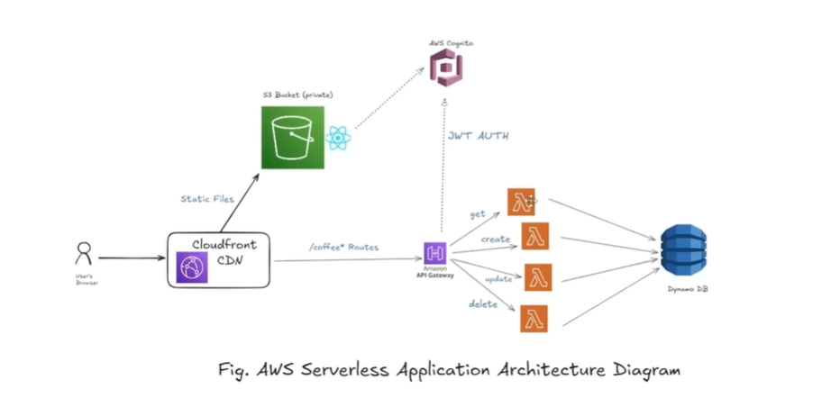

### Create an dynnamo db table constist attribute as id,name,available and price

### Create an iam role with a lamdabasicexecution and inline dynamodb  get,post etc policy

### Create an lambda function write code in vs code and export as zip and upload on a lambda
https://docs.aws.amazon.com/sdk-for-javascript/v3/developer-guide/javascript_dynamodb_code_examples.html

### Create an api gateway and provide route /coffee and /coffee/{id}

### api integration with a lambda function with a route

### individual file of each function with same dependecy are large hence perfrorm layer

### Create layer upload all nodejs required dependency in zip format attach to an lambda function
### zip -r layer.zip . 

### Hence not required to upload individual dependency from an each function layer is global for all attach function

---

# ☕ Serverless Coffee API (AWS)

This project demonstrates a **serverless full-stack application** using AWS services like **DynamoDB, Lambda, API Gateway, S3, and CloudFront**. It provides APIs to manage coffee items and serves a frontend via CDN.

---

## 📌 Architecture Overview

* **Database**: Amazon DynamoDB
* **Backend**: AWS Lambda (Node.js)
* **API Layer**: API Gateway
* **Storage (Frontend)**: S3
* **CDN**: CloudFront
* **Dependency Management**: Lambda Layers

---

## 🗂️ Features

* Create and fetch coffee items
* REST API with:

  * `GET /coffee` 
  * `GET /coffee/{id}` 
  * `POST /coffee` 
* Scalable serverless backend
* Shared dependencies using Lambda Layers
* Frontend hosted via S3 + CloudFront

---

## ⚙️ Setup Instructions

### 1. Create DynamoDB Table

Create a table with the following attributes:

* **Table Name**: `CoffeeTable` 
* **Primary Key**:

  * `id` (String)

Additional attributes:

* `name` (String)
* `available` (Boolean)
* `price` (Number)

---

### 2. Create IAM Role

Create an IAM role with:

#### ✅ Managed Policy:

* `AWSLambdaBasicExecutionRole` 

#### ✅ Inline Policy (DynamoDB Access):

```json
{
  "Version": "2012-10-17",
  "Statement": [
    {
      "Action": [
        "dynamodb:PutItem",
        "dynamodb:GetItem",
        "dynamodb:Scan",
        "dynamodb:UpdateItem",
        "dynamodb:DeleteItem"
      ],
      "Effect": "Allow",
      "Resource": "*"
    }
  ]
}
```

---

### 3. Create Lambda Functions

Develop Lambda functions in **Node.js (v18+)** using AWS SDK v3.

📖 Reference:
[https://docs.aws.amazon.com/sdk-for-javascript/v3/developer-guide/javascript_dynamodb_code_examples.html](https://docs.aws.amazon.com/sdk-for-javascript/v3/developer-guide/javascript_dynamodb_code_examples.html)

#### Example: `createCoffee.js` 

```javascript
import { DynamoDBClient, PutItemCommand } from "@aws-sdk/client-dynamodb";
import { v4 as uuidv4 } from "uuid";

const client = new DynamoDBClient({ region: "ap-south-1" });

export const handler = async (event) => {
  const body = JSON.parse(event.body);

  const params = {
    TableName: "CoffeeTable",
    Item: {
      id: { S: uuidv4() },
      name: { S: body.name },
      available: { BOOL: body.available },
      price: { N: body.price.toString() }
    }
  };

  await client.send(new PutItemCommand(params));

  return {
    statusCode: 201,
    body: JSON.stringify({ message: "Coffee created" })
  };
};
```

---

### 4. Package Lambda Code

Zip your function:

```bash
zip -r function.zip .
```

Upload the `.zip` file to AWS Lambda.

---

### 5. Create Lambda Layer

To avoid duplicating dependencies:

```bash
zip -r layer.zip nodejs/
```

* Upload as a Lambda Layer
* Attach layer to all Lambda functions

📌 Benefits:

* Shared dependencies
* Smaller function packages
* Easier maintenance

---

### 6. Create API Gateway

Create REST API with routes:

* `GET /coffee` 
* `GET /coffee/{id}` 
* `POST /coffee` 

---

### 7. Integrate API Gateway with Lambda

* Attach each route to corresponding Lambda function
* Enable **Lambda Proxy Integration**

---

### 8. Test API (Postman)

Use API Gateway endpoint:

```
https://<api-id>.execute-api.<region>.amazonaws.com/dev/coffee
```

Test:

* GET all coffees
* GET coffee by ID
* POST new coffee

---

### 9. Frontend Deployment

#### Build frontend:

```bash
npm run build
```

#### Upload `dist/` to S3:

* Create S3 bucket
* Enable static website hosting
* Upload all files from `dist` 

---

### 10. Configure CloudFront

#### Origins:

* S3 bucket (frontend)
* API Gateway (backend)

#### Setup:

* Attach **Origin Access Control (OAC)** to S3
* Add API Gateway as second origin

---

### 11. Configure Behaviors

| Path Pattern  | Origin      |
| ------------- | ----------- |
| `/coffee*`    | API Gateway |
| `Default (*)` | S3 Bucket   |

---

## 📁 Project Structure

```
project-root/
│
├── functions/
│   ├── createCoffee.js
│   ├── getCoffee.js
│   └── listCoffee.js
│
├── layer/
│   └── nodejs/
│       └── node_modules/
│
├── frontend/
│   └── dist/
│
└── README.md
```

---

## 🚀 Deployment Flow

1. Create DynamoDB table
2. Create IAM role
3. Develop Lambda functions
4. Create and attach Lambda Layer
5. Deploy API Gateway
6. Test APIs via Postman
7. Build frontend
8. Upload to S3
9. Configure CloudFront
10. Route API via CloudFront

---

## ✅ Notes

* Use **Lambda Layers** to avoid large deployment packages
* Keep IAM permissions minimal (principle of least privilege)
* Enable CORS in API Gateway if frontend consumes APIs
* Use environment variables for table name and region

---

## 🧪 Example Request

### POST `/coffee` 

```json
{
  "name": "Cappuccino",
  "available": true,
  "price": 150
}
```

---

## 📌 Future Improvements

* Add authentication (Cognito / JWT)
* Use Infrastructure as Code (CloudFormation / Terraform)
* Add logging & monitoring (CloudWatch)
* CI/CD pipeline

---

If you want, I can also generate:

* Terraform or CloudFormation for this setup
* Full frontend code
* Multiple Lambda functions (GET all, GET by ID, DELETE, UPDATE)
